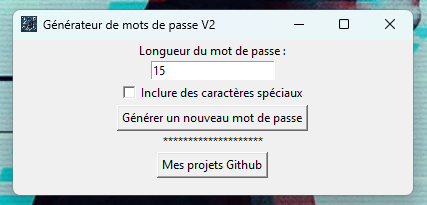

# 🔐 Générateur de mots de passe V2

Un **générateur de mots de passe avancé** développé en Python avec des fonctionnalités améliorées.

> Cette version est une amélioration de la [V1](https://github.com/Gw3nhael51/Genpass.exe/blob/main/generativepassw.py) avec de nouvelles fonctionnalités de sécurité.

## ✨ Fonctionnalités

- **Longueur personnalisable** avec 15 caractères minimum par défaut
- **Caractères spéciaux optionnels** pour une sécurité renforcée
- **Masquage automatique** du mot de passe avec des '\*'
- **Copie automatique** dans le presse-papiers
- **Interface graphique** intuitive avec Tkinter
- **Lien direct** vers les projets GitHub

---

## 📦 Installation et utilisation

### Option 1 : Télécharger l'exécutable

Vous pouvez télécharger l'application **.exe** directement :

[🔗 Télécharger GenpassV2.exe](https://drive.google.com/file/d/19D168m6MGTt_AvP4NuA995brggKlUT5D/view?usp=sharing) (version .zip)

⚠️ **Note de sécurité :**

- Votre antivirus peut émettre une alerte lors du téléchargement
- C'est normal pour les fichiers exécutables téléchargés depuis Internet
- Si vous faites confiance à la source, vous pouvez continuer l'installation

### Option 2 : Installation depuis le code source

#### Méthode automatique (recommandée)

1. Clonez le repository :

```bash
git clone https://github.com/Gw3nhael51/GenpassV2.git
cd GenpassV2
```

2. Lancez le script de configuration :

   - **Windows** : Double-cliquez sur `install_requirements.bat`
   - Le script va créer et activer l'environnement virtuel automatiquement

3. Installez les dépendances (dans le terminal activé) :

```bash
pip install -r requirements.txt
```

4. Lancez l'application :

```bash
python generativepasswV2.py
```

#### Méthode manuelle complète

1. Clonez le repository :

```bash
git clone https://github.com/Gw3nhael51/GenpassV2.git
cd GenpassV2
```

2. Créez un environnement virtuel :

```bash
python -m venv .venv
```

3. Activez l'environnement virtuel :

```bash
# Windows (CMD)
.venv\Scripts\activate

# Windows (PowerShell)
.venv\Scripts\Activate.ps1

# Linux/Mac
source .venv/bin/activate
```

4. Installez les dépendances :

```bash
pip install -r requirements.txt
```

5. Lancez l'application :

```bash
python generativepasswV2.py
```

#### 🔧 Dépannage

Si vous rencontrez des problèmes :

- **Erreur "pip not found"** : Assurez-vous que l'environnement virtuel est activé
- **Erreur d'installation** : Essayez `python -m pip install -r requirements.txt`
- **Erreur d'activation** : Exécutez le script en tant qu'administrateur
- **Erreur "pyperclip not found"** : Utilisez `python` au lieu de `py`

---

## 🛠️ Développement

### Prérequis

- Python 3.7+
- pip (gestionnaire de paquets Python)
- tkinter (inclus avec Python)
- pyperclip (pour la copie dans le presse-papiers)

### Installation des dépendances

```bash
pip install pyperclip
```

### Fonctionnalités techniques

- **Interface graphique** avec Tkinter
- **Génération sécurisée** avec `random` et `string`
- **Copie automatique** avec `pyperclip`
- **Navigation web** avec `webbrowser`

---

## 🔄 Différences avec la V1

| Fonctionnalité           | V1       | V2                    |
| ------------------------ | -------- | --------------------- |
| Longueur par défaut      | Variable | 15 caractères minimum |
| Longueur max (à faire)   | Non      | 30 caractères max     |
| Caractères spéciaux      | Non      | Optionnel             |
| Masquage du mot de passe | Non      | Oui (avec '\*')       |
| Copie automatique        | Non      | Oui                   |
| Interface graphique      | Basique  | Améliorée             |
| Lien GitHub              | Non      | Oui                   |

---

## 🖼️ Capture d'écran



---

## 🇬🇧 English version

An **advanced password generator** developed in Python with enhanced features.

> This version is an improvement of [V1](https://github.com/Gw3nhael51/Genpass.exe/blob/main/generativepassw.py) with new security features.

### Features

- **Customizable length** with 15 characters minimum by default
- **Optional special characters** for enhanced security
- **Automatic masking** of password with '\*'
- **Automatic copying** to clipboard
- **Intuitive graphical interface** with Tkinter
- **Direct link** to GitHub projects

### Download and usage

#### Option 1: Download the executable

You can download the **.exe application** directly:

[🔗 Download GenpassV2.exe](https://github.com/Gw3nhael51/GenpassV2/releases)

⚠️ **Security note:**

- Your antivirus may issue an alert during download
- This is normal for executable files downloaded from the Internet
- If you trust the source, you can continue with the installation

#### Option 2: Installation from source code

##### Automatic method (recommended)

1. Clone the repository:

```bash
git clone https://github.com/Gw3nhael51/GenpassV2.git
cd GenpassV2
```

2. Run the configuration script:

   - **Windows** : Double-click on `install_requirements.bat`
   - The script will create and activate the virtual environment automatically

3. Install dependencies (in the activated terminal):

```bash
pip install -r requirements.txt
```

4. Run the application:

```bash
python generativepasswV2.py
```

##### Complete manual method

1. Clone the repository:

```bash
git clone https://github.com/Gw3nhael51/GenpassV2.git
cd GenpassV2
```

2. Create a virtual environment:

```bash
python -m venv .venv
```

3. Activate the virtual environment:

```bash
# Windows (CMD)
.venv\Scripts\activate

# Windows (PowerShell)
.venv\Scripts\Activate.ps1

# Linux/Mac
source .venv/bin/activate
```

4. Install dependencies:

```bash
pip install -r requirements.txt
```

5. Run the application:

```bash
python generativepasswV2.py
```

##### 🔧 Troubleshooting

If you encounter problems:

- **"pip not found" error** : Make sure the virtual environment is activated
- **Installation error** : Try `python -m pip install -r requirements.txt`
- **Activation error** : Run the script as administrator
- **"pyperclip not found" error** : Use `python` instead of `py`

### Technical features

- **Graphical interface** with Tkinter
- **Secure generation** with `random` and `string`
- **Automatic copying** with `pyperclip`
- **Web navigation** with `webbrowser`

---

<!--
README V2 avec versions française et anglaise complètes et cohérentes.
Instructions d'installation détaillées, dépannage, et capture d'écran.
-->
